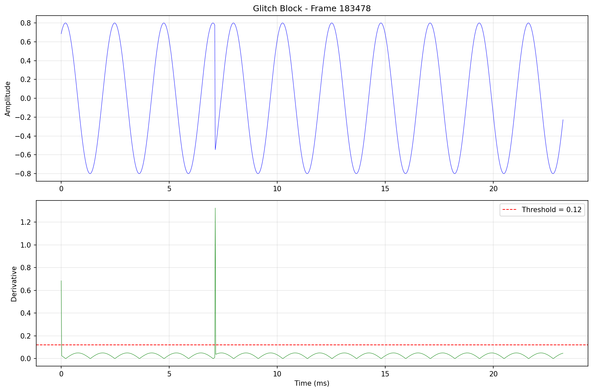

# Audio Glitch Detector
Detect audio glitches and discontinuities in sinusoidal audio signals by analyzing the first derivative.

## Can process
- a .wav file
- an audio stream (using `pyaudio` build on `portaudio`)

**Important:** This tool only works with sinusoidal signals and will not work with other types of audio content.

## Setup using uv
Install dependencies:
```
uv sync --dev
```

## See options
```
uv run audio-glitch-detector -h
```

## How to use
### Detect discontinuities in a .wav file
```
uv run audio-glitch-detector -f /path/to/file
```

### Detect discontinuities in an audio stream
```
uv run audio-glitch-detector
```
Select audio device

### Save glitch blocks for analysis
Use the `--save-blocks` flag to save audio blocks containing detected glitches as both WAV files and PNG waveform visualizations:

The PNG files show the waveform with derivative analysis.



## Test files
the folder `test_files/` contains files of sine tones with a known number of discontinuities
```
uv run audio-glitch-detector -f test_files/sine_discont_2_mono.wav
```
Outputs
```
Number of discontinuities detected:  2
0:00:01.892857
0:00:03.288367
```

### Detection limitations
`sine_subtle_error_stereo.wav` contains a errors which are harder for the algorithm to detect. Lowering the threshold to `0.1` will detect the discontinuities. A too low threshold will result in false positives - and a lot of them...

## Development

### Install development dependencies
```
uv sync --dev
```

### Run tests
```
uv run pytest
```
